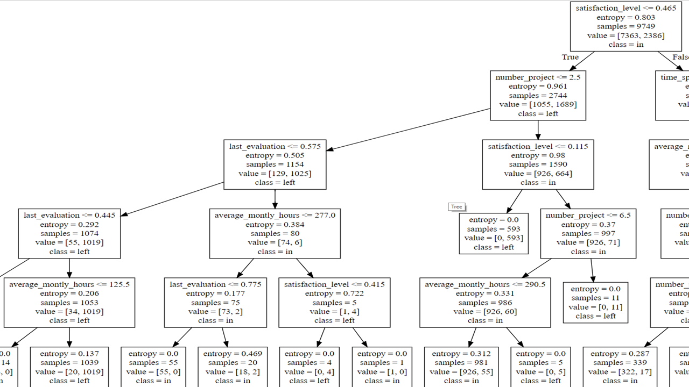

# Human resource management and machine learning research: My experience
----

 

 
Being in India has been one of the best experiences I have ever had. I am very proud of being part and made so great friends in one of the most prestigious universities in India: Indian Institute of Technology Delhi, IIT Delhi. Also tell all my new friends about my great university in Mexico and about Mexico in general. 
When I arrived, I realize not everyone was going to speak English in India, almost all people understand (I think so) but speaking for them is difficult. When I arrived to Satpura, what I called house, an almost graduate student, Dhruv, helped me out get my SIM activated and tried to fix out my stay in Satpura, complicated. Later, my friend and right hand, Swapnil got everything done to get my room: SA-10 in the ground floor, way better in the ground, because there, it was not that hot. First day was the thing! No chain, very light and uncomfortable mattress and a lot of mosquitoes made me woke up around 5 am. 
The adventure started, practically first day in India. First experience, get my room and stay paid. The food in the mess was very good, at least for me, as a foreigner I found it great. However, some friends told me, having the same food for four years is hell.  
I did not know anyone in India at that time (except for Prof. Vigneswara, Swapnil and Drhuv), and I did not have any classes. So, most of my friends I met them on the TV room and the mess. One of the very first friend I made in India was Jeevarej from Tamil Nadu, doing his postdoc in mathematics, working in fuzzy logic (later I realized how important is for modeling). I just asked him, "do you speak English?" He told me he does, and we started speaking, he also told me that he does not speak Hindi so when he arrived to IIT Delhi, he was asking the same question. 
Delhi is very beautiful, so diverse and full of heritage, is in the heart of India, in fact that is what Delh means in English: HEART. If you are there you must visit AGRA and JAIPUR: THE GOLDEN TRIANGLE. You can use train, metro, auto, Uber and so on. 
 

 
 

 

## India culture.
I enjoyed the movies, music, food and art. I am not a vegetarian; nevertheless, you can have chicken. I had chicken masala, pani puri, Palak Paneer, Malai Kofta, Kaali Daal, Chole Bhature, Aloo Ka Halwa, Paratha, Sweet Lassi, Curry, Chicken Biriyani, Jalebi, Gulab Jamun, Idili, Melu Vada, Masala Dosa, Tandori Chicken, Chapati. 
 

 
India produces tons of music, what I heard the most were Punjabi songs and movies. Movies are full of emotions. Everyone studying in an engineering college in India have watched "3 IDIOTS" is a great movie, so real! PK, Barfi!, Namastey London, were very good movies as well. I went to a Bollywood musical: ZANGOORA, in Kingdom of dreams. 
I went to the National Gallery of modern art, Jamini Roy, Krishen Khanna, Biren De, Santosh, Goud, Saroj Pal, Anju Dodiya, Sudhir Patwardhan; were my favorites artists. I enjoyed visiting Delhi, their temples, their markets and all sites. 
I visited a lot of places, from the very famous Qutab Minar to a Sunday old books market.
 

 

## The research
Before arriving India, I was told that for the time that I would be in India, doing a SYSTEMATIC LITEARURE REVIEW was feasible. Since the first day in India I started working on that. The main idea of a systematic literature review is to find ideas, gaps, relations, contradictions, patterns etc. In papers regarding your investigation topic that might help other researchers to understand what researches have already been done, what is the progress and on what topics there are interesting scopes.
The first challenge you might face are academic databases, do not worry, almost every university around the world will provide you access to a lot of DB's and a lot of papers. I started working with Google Scholar, JSTOR, IEEE, ACM, SpringerLink, EmeraldInsight and Scopus. I was told to use only Scopus. The latter has a lot of papers regarding technology, so we found it very helpful. 
If you want to do a literature review (in other words a review of the topic) always use ADVANCED SEARCHES. You are going to find very helpful the Boolean operators: AND, OR NOT.
If you type: Miami dolphins, the algorithm needs to be smart enough to know what you are meaning through that: is it dolphins in Miami? is it just dolphins? is it just Miami? is it the football team? Same happens with academic DB's you must use certain tools to narrow or filter smartly your search. 
Also, what specific topics are you going to include in your query, for example, probably the paper is not explicitly stating machine learning, though is stating data mining or SVM or Random forests or data-driven or even analytics. You might consider include all these topics as an OR. Same for Human resource management, you can find recruitment, workforce, human capital, talent management, etc. A lot of tools and theories that might be the main topic of the paper.
You need to apply a nested search, in other words, the use of parenthesis. And using "" might be a good idea, if you look for: MACHINE AND LEARNING. You will find thousands of papers with the word machine and with the word learning that have nothing to do, and within papers regarding MACHINE LEARNING. Yet, to combine ML and HRM you must use an AND and parenthesis, like: ("machine learning" OR "data mining") AND ("human resource management" OR "human capital").
Sci-hub (helping removing all barriers in the way of science) is a website that provides us tons of academic papers for free.
You need to extract the important articles found on your search, by title, abstract or even by reading the whole paper, this is the important part of a SYSTEMATIC LITERATURE REVIEW, in this part you need to write down everything down, what characteristics a paper most contain to be in the final papers and so on. The main idea is to extract information of the papers written, for example, topic or constructs, keywords, year, journals, etc. Probably the most complicated part is reading all your final articles, obviously is better to make a SLR with more than 30 papers. We found out more than 100 papers. And you need to decide what information is important. 
I was asked to build a constructs bar chart, so we can understand what exactly researchers are being working on. 
>Constructs are similar to concepts and they are relevant to the decision problem faced in the research. Why we use concepts? Because it is easier for us to communicate and facilitate the communication process. For example, triangles, there are a lot of types of triangles out there, however we know the key of triangles: three sides! A construct is a generalized abstraction of some aspect of reality that we want to understand for doing a research. Also, there must be worthy of measurement. Example of constructs might be: Love, aggression, intelligence, life satisfaction.

The rest is just writing the paper, include conclusions, gaps, new ideas. And some groupings of the final papers, for example in our case, algorithms or human resources tasks is a nice criterion for grouping.

## Decision Rules in a HRM context
After reading around 150 papers I discovered two important things, there are no clear definitions regarding data mining, data science, machine learning and so on; secondly, the importance of understanding algorithms, and the use of decision rules.
Data Science is a broad discipline, even though the concept is recent, every day is evolving. 
>According to Berkeley School of Information, the Data Science Life Cycle has five stages, this stages are not exclusive from one another. This five stages are Data Capture, Data Maintain, Data Process, Data Analysis and Data Communication. 

The latter is the most important activity in businesses. It is where we deliver Data Visualizations, Data Reports, Business Intelligence and Decision Making.  Most often, all the time spent in the remaining stages will end up in making decisions, based on the whole process, so we can constantly improve. 
When trying to solve a data science problem, there are plenty of techniques you can use in order to puzzle it out; for example, support vector machines (SVM), decision trees, logistic regression, neural networks and many others. The big problem is that almost all of them are black boxes, you probably know what the algorithm is doing, hopefully, but your co-workers or random ordinary people might not understand the intuition behind those complex models. So as a data scientist you should not only extract value from data but also being able to translate results into solutions and then communicate that. Decision rules will help us extract clear conclusions on how the algorithm is making decisions. So we can later on make decision based on that. 
We can extract decision rules using Python and some well-known libraries.  We are going to use an HR dataset provided by Kaggle contest. The features of the dataset are satisfaction level, last evaluation, number project, average monthly hours, time spend company, Work accident, left, promotion last 5 years, sales, and salary. <strong> Left </strong> variable will be our target. Basically we want two extract two things from our algorithm, the prediction of our target variable, in this case whether the employee leaved or not and why they are leaving. What features increases attrition risk? Those features will be the rest of the dataset, the variables that we will use to feed the decision tree. Basically, the root node is our entire dataset that will later be splitted based on our selected strategy like Gini Index, Chi-square, entropy or variance reduction. The dataset has 10 columns and 14,999 observations. 2 features are object data types, to work with scikit-learn we will transform to dummies those features, using pandas. We will use a train and a test data; the test will have 35% of the whole data. 
To make the tree easier to interpret we are going to set the maximum depth of the tree to 5, so we can have more representative samples from all nodes. The score stills being pretty good with .97, and we can generalize the rules provided by the tree more easily. Like in everything, we will face the trade-off, between a bigger precision and an easier to interpret algorithm.  
Once we call all the methods we will get a dot file, we can open that file with a text processor. Do not worry, it is not that complicated. Essentially, is a bunch of steps to build a visual decision tree, you can do that with python as well.  But it is even easier to visualize all that code, just using the web! Copy and paste all the lines to:  http://www.webgraphviz.com/  Then, just click on <strong>Generate graph</strong>.
 

You will automatically get a decision tree. If it is to robust, probably you might consider moving the parameters of the algorithm. 

## Ready?
 

Lets extract the rules from the decision tree. First some concepts: 
* Entropy: 
Measure of unpredictability of information content in other words is how much information we learn on average from one instance. We are looking for zero when speaking about entropy. Zero means there is only one label in the node. 
* Samples:
The amount of observations in each node. 
* Value:
The amount of observations in each label. The one on the left is the zero value and the one on the right is the number 1. In this case  in and left respectively. 

To extract decision rules from our tree we must consider the nodes at the end (end nodes) and then all the way up until the root node (backward) or vice versa (forward). It is important to cover all the branch. Otherwise our decisions will be less accurate. 
To extract relevant conclusions, we must ponder those end nodes with tons of observations no matter they are 0 or 1 (in or left). The most relevant include 1039, 981, 5261, 631 samples. 
1. If average month worked hours are more than 126 hours and the result on the last evaluation is between 0.445 and 0.574, and he or she  has less than 2 projects and a satisfaction level less than 0.465 he or she will be more inclined to leave the organization. 
 

2. If satisfaction level of the workers is less than 0.465 and the average monthly worked hours are less than 290 hours and finally the > number of projects is between 3 and 6, then the employee will move towards staying in the organization
 

3. If the worker has between 3 and 5 projects and worked less than 290 hours and has less than 4 years in the organization and a satisfaction level more than 0.465 they will be more inclined to stay in the company. 

4. If the time spent in the organization is between 5 and 7 years and the last evaluation scoring is more than 0.8 points, working more than 214 > hours on average a month, having a satisfaction level more than 0.46 they will be prone to leave the company.
 

 

Finally, Plotting the importance of the features might be a good idea. This can give us a clue on what a worker values the most or at least worries the most. You can obtain this information through the feature_importances_ parameter. And then you just have to plot it. 
Definitely satisfaction level is very importan when making a decision, also the years in the company and the last evaluation, last but not least the number of projects and the monthly hours working. We can say that accidents in the organization, promotions, salary and position are irrelevant. 
 

